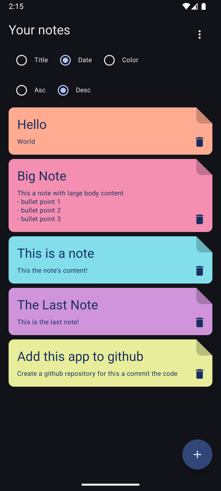

# Note Application

## Key features

- List notes
- Add new note
- Edit new note
- Sort notes with title, color, date

## Architecture

- Clean Architecture

## Stack

- kotlin
- Jetpack compose
- Dagger Hilt
- Room database
- Coroutines

## List Notes Screen

## Add Note Screen

